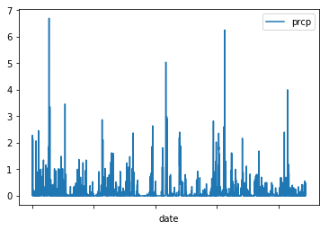
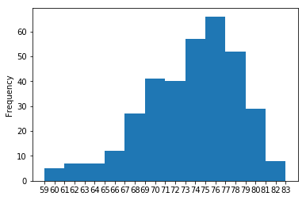
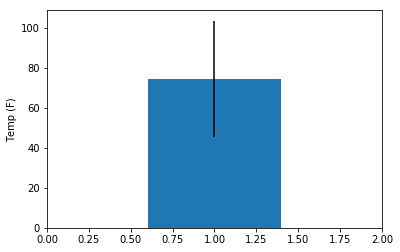

Step 3 - Climate Analysis and Exploration

You are now ready to use Python and SQLAlchemy to do basic climate analysis and data exploration on your new weather station tables. All of the following analysis should be completed using SQLAlchemy ORM queries, Pandas, and Matplotlib.


Create a Jupyter Notebook file called climate_analysis.ipynb and use it to complete your climate analysis and data exploration.
Choose a start date and end date for your trip. Make sure that your vacation range is approximately 3-15 days total.
Use SQLAlchemy create_engine to connect to your sqlite database.
Use SQLAlchemy automap_base() to reflect your tables into classes and save a reference to those classes called Station and Measurement.


```python
import sqlalchemy
from sqlalchemy.ext.automap import automap_base
from sqlalchemy.orm import Session
from sqlalchemy import create_engine
import pandas as pd
import matplotlib
import numpy as np
from sqlalchemy import func


import matplotlib.pyplot as plt
```


```python
engine = create_engine("sqlite:///hawaii.sqlite")
```


```python
Base = automap_base()
```


```python
Base.prepare(engine, reflect=True)
```


```python
Base.classes.keys()
```


```python
Station = Base.classes.Station
```


```python
Station.__dict__
```


```python
Measurement = Base.classes.Measurement
```


```python
session = Session(engine)
```

Precipitation Analysis


Design a query to retrieve the last 12 months of precipitation data.
Select only the date and prcp values.
Load the query results into a Pandas DataFrame and set the index to the date column.
Plot the results using the DataFrame plot method.


```python
session.query(Measurement.date,Measurement.prcp).order_by(Measurement.date.desc()).first()
```


    ('2017-08-23', 0.0)


```python
results = session.query(Measurement.date,Measurement.prcp).filter(Measurement.date>'2016-08-23')\
                                                        .order_by(Measurement.date).all()
results
```


    [('2016-08-24', 0.08),
     ('2016-08-24', 2.15),
     ('2016-08-24', 2.28),
     ('2016-08-24', 0.0),
     ('2016-08-24', 1.22),
     ('2016-08-24', 2.15),
     ('2016-08-24', 1.45),
     ('2016-08-25', 0.08),
     ('2016-08-25', 0.08),
     ('2016-08-25', 0.0),
     ('2016-08-25', 0.0),
     ('2016-08-25', 0.21),
     ('2016-08-25', 0.06),
     ('2016-08-25', 0.11),
     ('2016-08-26', 0.0),
     ('2016-08-26', 0.03),
     ('2016-08-26', 0.02),
     ('2016-08-26', 0.04),
     ('2016-08-26', 0.0),
     ('2016-08-26', 0.01),
     ('2016-08-27', 0.0),
     ('2016-08-27', 0.18),
     ('2016-08-27', 0.02),
     ('2016-08-27', 0.0),
     ('2016-08-27', 0.12),
     ('2016-08-27', 0.0),
     ('2016-08-28', 0.01),
     ('2016-08-28', 0.14),
     ('2016-08-28', 0.14),
     ('2016-08-28', 0.14),
     ('2016-08-28', 0.6),
     ('2016-08-28', 2.07),
     ('2016-08-29', 0.0),
     ('2016-08-29', 0.17),
     ('2016-08-29', 0.04),
     ('2016-08-29', 0.0),
     ('2016-08-29', 0.0),
     ('2016-08-29', 0.35),
     ('2016-08-29', 0.9),
     ('2016-08-30', 0.0),
     ('2016-08-30', 0.0),
     ('2016-08-30', 0.02),
     ('2016-08-30', 0.0),
     ('2016-08-30', 0.0),
     ('2016-08-30', 0.05),
     ('2016-08-31', 0.13),
     ('2016-08-31', 0.1),
     ('2016-08-31', 0.0),
     ('2016-08-31', 0.0),
     ('2016-08-31', 0.25),
     ('2016-08-31', 0.24),
     ('2016-08-31', 2.46),
     ('2016-09-01', 0.0),
     ('2016-09-01', 0.0),
     ('2016-09-01', 0.0),
     ('2016-09-01', 0.0),
     ('2016-09-01', 0.02),
     ('2016-09-01', 0.01),
     ('2016-09-02', 0.0),
     ('2016-09-02', 0.02),
     ('2016-09-02', 0.19),
     ('2016-09-02', 0.0),
     ('2016-09-02', 0.0),
     ('2016-09-02', 0.01),
     ('2016-09-02', 0.03),
     ('2016-09-03', 0.0),
     ('2016-09-03', 0.07),
     ('2016-09-03', 0.08),
     ('2016-09-03', 0.12),
     ('2016-09-03', 1.0),
     ('2016-09-04', 0.03),
     ('2016-09-04', 0.03),
     ('2016-09-04', 0.74),
     ('2016-09-04', 0.14),
     ('2016-09-04', 0.44),
     ('2016-09-05', 0.0),
     ('2016-09-05', 0.11),
     ('2016-09-05', 0.0),
     ('2016-09-05', 0.02),
     ('2016-09-05', 0.03),
     ('2016-09-05', 0.18),
     ('2016-09-06', 0.0),
     ('2016-09-06', 0.05),
     ('2016-09-06', 0.04),
     ('2016-09-06', 0.03),
     ('2016-09-06', 0.11),
     ('2016-09-06', 1.0),
     ('2016-09-07', 0.05),
     ('2016-09-07', 0.1),
     ('2016-09-07', 0.23),
     ('2016-09-07', 0.11),
     ('2016-09-07', 0.16),
     ('2016-09-07', 1.35),
     ('2016-09-08', 0.0),
     ('2016-09-08', 0.22),
     ('2016-09-08', 0.01),
     ('2016-09-08', 0.0),
     ('2016-09-08', 0.01),
     ('2016-09-08', 0.07),
     ('2016-09-08', 0.15),
     ('2016-09-09', 0.03),
     ('2016-09-09', 0.01),
     ('2016-09-09', 0.29),
     ('2016-09-09', 0.0),
     ('2016-09-09', 0.23),
     ('2016-09-09', 0.16),
     ('2016-09-09', 0.35),
     ('2016-09-10', 0.0),
     ('2016-09-10', 0.01),
     ('2016-09-10', 0.14),
     ('2016-09-10', 0.09),
     ('2016-09-10', 1.16),
     ('2016-09-11', 0.05),
     ('2016-09-11', 0.18),
     ('2016-09-11', 0.12),
     ('2016-09-11', 0.3),
     ('2016-09-11', 0.6),
     ('2016-09-12', 0.0),
     ('2016-09-12', 0.04),
     ('2016-09-12', 0.0),
     ('2016-09-12', 0.0),
     ('2016-09-12', 0.15),
     ('2016-09-12', 0.31),
     ('2016-09-12', 1.04),
     ('2016-09-13', 0.02),
     ('2016-09-13', 0.37),
     ('2016-09-13', 0.32),
     ('2016-09-13', 0.0),
     ('2016-09-13', 0.46),
     ('2016-09-13', 0.34),
     ('2016-09-13', 1.2),
     ('2016-09-14', 1.32),
     ('2016-09-14', 0.9),
     ('2016-09-14', 1.84),
     ('2016-09-14', 0.0),
     ('2016-09-14', 1.19),
     ('2016-09-14', 2.33),
     ('2016-09-14', 6.7),
     ('2016-09-15', 0.42),
     ('2016-09-15', 0.12),
     ('2016-09-15', 0.07),
     ('2016-09-15', 0.0),
     ('2016-09-15', 0.17),
     ('2016-09-15', 0.83),
     ('2016-09-15', 3.35),
     ('2016-09-16', 0.06),
     ('2016-09-16', 0.01),
     ('2016-09-16', 0.07),
     ('2016-09-16', 0.0),
     ('2016-09-16', 0.01),
     ('2016-09-16', 0.06),
     ('2016-09-16', 0.61),
     ('2016-09-17', 0.05),
     ('2016-09-17', 0.04),
     ('2016-09-17', 0.0),
     ('2016-09-17', 0.36),
     ('2016-09-17', 0.23),
     ('2016-09-18', 0.0),
     ('2016-09-18', 0.0),
     ('2016-09-18', 0.04),
     ('2016-09-18', 0.07),
     ('2016-09-18', 0.42),
     ('2016-09-19', 0.0),
     ('2016-09-19', 0.01),
     ('2016-09-19', 0.0),
     ('2016-09-19', 0.0),
     ('2016-09-19', 0.05),
     ('2016-09-19', 0.01),
     ('2016-09-19', 0.25),
     ('2016-09-20', 0.0),
     ('2016-09-20', 0.09),
     ('2016-09-20', 0.25),
     ('2016-09-20', 0.0),
     ('2016-09-20', 0.04),
     ('2016-09-20', 0.22),
     ('2016-09-20', 0.43),
     ('2016-09-21', 0.0),
     ('2016-09-21', 0.06),
     ('2016-09-21', 0.02),
     ('2016-09-21', 0.0),
     ('2016-09-21', 0.07),
     ('2016-09-21', 1.02),
     ('2016-09-22', 0.02),
     ('2016-09-22', 0.09),
     ('2016-09-22', 0.17),
     ('2016-09-22', 0.06),
     ('2016-09-22', 0.01),
     ('2016-09-22', 0.34),
     ('2016-09-22', 0.75),
     ('2016-09-23', 0.0),
     ('2016-09-23', 0.15),
     ('2016-09-23', 0.15),
     ('2016-09-23', 0.0),
     ('2016-09-23', 0.0),
     ('2016-09-23', 0.94),
     ('2016-09-23', 0.33),
     ('2016-09-24', 0.0),
     ('2016-09-24', 0.0),
     ('2016-09-24', 0.0),
     ('2016-09-24', 0.0),
     ('2016-09-24', 0.01),
     ('2016-09-24', 0.27),
     ('2016-09-25', 0.0),
     ('2016-09-25', 0.02),
     ('2016-09-25', 0.0),
     ('2016-09-25', 0.0),
     ('2016-09-25', 0.03),
     ('2016-09-25', 0.04),
     ('2016-09-26', 0.06),
     ('2016-09-26', 0.06),
     ('2016-09-26', 0.02),
     ('2016-09-26', 0.0),
     ('2016-09-26', 0.34),
     ('2016-09-26', 0.17),
     ('2016-09-26', 1.02),
     ('2016-09-27', 0.02),
     ('2016-09-27', 0.12),
     ('2016-09-27', 0.0),
     ('2016-09-27', 0.05),
     ('2016-09-27', 0.17),
     ('2016-09-27', 1.0),
     ('2016-09-28', 0.0),
     ('2016-09-28', 0.08),
     ('2016-09-28', 0.0),
     ('2016-09-28', 0.0),
     ('2016-09-28', 0.0),
     ('2016-09-28', 0.0),
     ('2016-09-28', 0.05),
     ('2016-09-29', 0.0),
     ('2016-09-29', 0.49),
     ('2016-09-29', 0.2),
     ('2016-09-29', 0.04),
     ('2016-09-29', 0.18),
     ('2016-09-29', 0.59),
     ('2016-09-29', 1.49),
     ('2016-09-30', 0.0),
     ('2016-09-30', 0.31),
     ('2016-09-30', 0.06),
     ('2016-09-30', 0.0),
     ('2016-09-30', 0.15),
     ('2016-09-30', 0.25),
     ('2016-09-30', 0.38),
     ('2016-10-01', 0.0),
     ('2016-10-01', 0.14),
     ('2016-10-01', 0.08),
     ('2016-10-01', 0.07),
     ('2016-10-01', 0.14),
     ('2016-10-01', 1.02),
     ('2016-10-02', 0.0),
     ('2016-10-02', 0.02),
     ('2016-10-02', 0.03),
     ('2016-10-02', 0.0),
     ('2016-10-02', 0.06),
     ('2016-10-02', 0.61),
     ('2016-10-03', 0.0),
     ('2016-10-03', 0.04),
     ('2016-10-03', 0.03),
     ('2016-10-03', 0.0),
     ('2016-10-03', 0.0),
     ('2016-10-03', 0.16),
     ('2016-10-03', 0.46),
     ('2016-10-04', 0.0),
     ('2016-10-04', 0.0),
     ('2016-10-04', 0.0),
     ('2016-10-04', 0.0),
     ('2016-10-04', 0.0),
     ('2016-10-04', 0.03),
     ('2016-10-04', 3.46),
     ('2016-10-05', 0.0),
     ('2016-10-05', 0.0),
     ('2016-10-05', 0.0),
     ('2016-10-05', 0.0),
     ('2016-10-05', 0.0),
     ('2016-10-05', 0.01),
     ('2016-10-05', 0.81),
     ('2016-10-06', 0.0),
     ('2016-10-06', 0.05),
     ('2016-10-06', 0.0),
     ('2016-10-06', 0.07),
     ('2016-10-06', 0.0),
     ('2016-10-06', 0.0),
     ('2016-10-06', 0.04),
     ('2016-10-07', 0.0),
     ('2016-10-07', 0.0),
     ('2016-10-07', 0.0),
     ('2016-10-07', 0.0),
     ('2016-10-07', 0.0),
     ('2016-10-07', 0.0),
     ('2016-10-07', 0.01),
     ('2016-10-08', 0.0),
     ('2016-10-08', 0.0),
     ('2016-10-08', 0.0),
     ('2016-10-08', 0.0),
     ('2016-10-08', 0.04),
     ('2016-10-09', 0.0),
     ('2016-10-09', 0.0),
     ('2016-10-09', 0.0),
     ('2016-10-09', 0.0),
     ('2016-10-09', 0.0),
     ('2016-10-10', 0.0),
     ('2016-10-10', 0.0),
     ('2016-10-10', 0.0),
     ('2016-10-10', 0.0),
     ('2016-10-10', 0.0),
     ('2016-10-10', 0.0),
     ('2016-10-11', 0.0),
     ('2016-10-11', 0.02),
     ('2016-10-11', 0.04),
     ('2016-10-11', 0.0),
     ('2016-10-11', 0.0),
     ('2016-10-11', 0.28),
     ('2016-10-11', 0.35),
     ('2016-10-12', 0.0),
     ('2016-10-12', 0.03),
     ('2016-10-12', 0.0),
     ('2016-10-12', 0.0),
     ('2016-10-12', 0.03),
     ('2016-10-12', 0.02),
     ('2016-10-13', 0.0),
     ('2016-10-13', 0.0),
     ('2016-10-13', 0.02),
     ('2016-10-13', 0.0),
     ('2016-10-13', 0.0),
     ('2016-10-13', 0.0),
     ('2016-10-13', 0.06),
     ('2016-10-14', 0.0),
     ('2016-10-14', 0.0),
     ('2016-10-14', 0.0),
     ('2016-10-14', 0.0),
     ('2016-10-14', 0.0),
     ('2016-10-14', 0.0),
     ('2016-10-15', 0.0),
     ('2016-10-15', 0.0),
     ('2016-10-15', 0.02),
     ('2016-10-15', 0.0),
     ('2016-10-15', 0.04),
     ('2016-10-15', 0.33),
     ('2016-10-16', 0.0),
     ('2016-10-16', 0.0),
     ('2016-10-16', 0.0),
     ('2016-10-16', 0.0),
     ('2016-10-16', 0.0),
     ('2016-10-17', 0.01),
     ('2016-10-17', 0.03),
     ('2016-10-17', 0.0),
     ('2016-10-17', 0.0),
     ('2016-10-17', 0.12),
     ('2016-10-17', 0.01),
     ('2016-10-17', 0.38),
     ('2016-10-18', 0.0),
     ('2016-10-18', 0.05),
     ('2016-10-18', 0.03),
     ('2016-10-18', 0.0),
     ('2016-10-18', 0.02),
     ('2016-10-18', 0.02),
     ('2016-10-18', 0.48),
     ('2016-10-19', 0.0),
     ('2016-10-19', 0.06),
     ('2016-10-19', 0.0),
     ('2016-10-19', 0.0),
     ('2016-10-19', 0.0),
     ('2016-10-19', 0.11),
     ('2016-10-19', 0.0),
     ('2016-10-20', 0.0),
     ('2016-10-20', 0.0),
     ('2016-10-20', 0.01),
     ('2016-10-20', 0.0),
     ('2016-10-20', 0.0),
     ('2016-10-20', 1.0),
     ('2016-10-21', 0.05),
     ('2016-10-21', 0.15),
     ('2016-10-21', 0.03),
     ('2016-10-21', 0.0),
     ('2016-10-21', 0.0),
     ('2016-10-21', 0.0),
     ('2016-10-21', 0.09),
     ('2016-10-22', 0.15),
     ('2016-10-22', 0.1),
     ('2016-10-22', 0.0),
     ('2016-10-22', 0.15),
     ('2016-10-22', 1.37),
     ('2016-10-23', 0.01),
     ('2016-10-23', 0.01),
     ('2016-10-23', 0.0),
     ('2016-10-23', 0.0),
     ('2016-10-23', 0.02),
     ('2016-10-23', 0.24),
     ('2016-10-24', 0.0),
     ('2016-10-24', 0.0),
     ('2016-10-24', 0.01),
     ('2016-10-24', 0.0),
     ('2016-10-24', 0.0),
     ('2016-10-24', 0.08),
     ('2016-10-24', 0.7),
     ('2016-10-25', 0.03),
     ('2016-10-25', 0.04),
     ('2016-10-25', 0.0),
     ('2016-10-25', 0.4),
     ('2016-10-25', 0.12),
     ('2016-10-25', 0.11),
     ('2016-10-25', 0.4),
     ('2016-10-26', 0.0),
     ('2016-10-26', 0.06),
     ('2016-10-26', 0.2),
     ('2016-10-26', 0.02),
     ('2016-10-26', 0.01),
     ('2016-10-26', 0.0),
     ('2016-10-27', 0.0),
     ('2016-10-27', 0.11),
     ('2016-10-27', 0.2),
     ('2016-10-27', 0.0),
     ('2016-10-27', 0.08),
     ('2016-10-27', 0.22),
     ('2016-10-27', 1.25),
     ('2016-10-28', 0.0),
     ('2016-10-28', 0.02),
     ('2016-10-28', 0.07),
     ('2016-10-28', 0.0),
     ('2016-10-28', 0.06),
     ('2016-10-28', 0.05),
     ('2016-10-28', 0.37),
     ('2016-10-29', 0.0),
     ('2016-10-29', 0.02),
     ('2016-10-29', 0.26),
     ('2016-10-29', 0.01),
     ('2016-10-29', 0.1),
     ('2016-10-29', 0.25),
     ('2016-10-30', 0.24),
     ('2016-10-30', 0.1),
     ('2016-10-30', 0.14),
     ('2016-10-30', 0.0),
     ('2016-10-30', 0.16),
     ('2016-10-30', 0.95),
     ('2016-10-31', 0.03),
     ('2016-10-31', 0.03),
     ('2016-10-31', 0.0),
     ('2016-10-31', 0.0),
     ('2016-10-31', 0.13),
     ('2016-10-31', 0.07),
     ('2016-10-31', 1.35),
     ('2016-11-01', 0.0),
     ('2016-11-01', 0.01),
     ('2016-11-01', 0.0),
     ('2016-11-01', 0.01),
     ('2016-11-01', 0.1),
     ('2016-11-01', 0.09),
     ('2016-11-02', 0.0),
     ('2016-11-02', 0.0),
     ('2016-11-02', 0.0),
     ('2016-11-02', 0.0),
     ('2016-11-02', 0.0),
     ('2016-11-02', 0.04),
     ('2016-11-03', 0.0),
     ('2016-11-03', 0.0),
     ('2016-11-03', 0.0),
     ('2016-11-03', 0.0),
     ('2016-11-03', 0.0),
     ('2016-11-03', 0.02),
     ('2016-11-04', 0.0),
     ('2016-11-04', 0.0),
     ('2016-11-04', 0.0),
     ('2016-11-04', 0.0),
     ('2016-11-04', 0.0),
     ('2016-11-04', 0.0),
     ('2016-11-04', 0.06),
     ('2016-11-05', 0.0),
     ('2016-11-05', 0.02),
     ('2016-11-05', 0.0),
     ('2016-11-05', 0.02),
     ('2016-11-05', 0.03),
     ('2016-11-05', 0.38),
     ('2016-11-06', 0.0),
     ('2016-11-06', 0.02),
     ('2016-11-06', 0.0),
     ('2016-11-06', 0.0),
     ('2016-11-06', 0.01),
     ('2016-11-06', 0.05),
     ('2016-11-07', 0.0),
     ('2016-11-07', 0.0),
     ('2016-11-07', 0.13),
     ('2016-11-07', 0.0),
     ('2016-11-07', 0.0),
     ('2016-11-07', 0.0),
     ('2016-11-07', 0.05),
     ('2016-11-08', 0.07),
     ('2016-11-08', 0.14),
     ('2016-11-08', 0.02),
     ('2016-11-08', 0.15),
     ('2016-11-08', 0.21),
     ('2016-11-08', 0.53),
     ('2016-11-09', 0.0),
     ('2016-11-09', 0.08),
     ('2016-11-09', 0.17),
     ('2016-11-09', 0.0),
     ('2016-11-09', 0.0),
     ('2016-11-09', 0.11),
     ('2016-11-09', 0.04),
     ('2016-11-10', 0.0),
     ('2016-11-10', 0.0),
     ('2016-11-10', 0.0),
     ('2016-11-10', 0.0),
     ('2016-11-10', 0.0),
     ('2016-11-10', 0.01),
     ('2016-11-11', 0.0),
     ('2016-11-11', 0.0),
     ('2016-11-11', 0.0),
     ('2016-11-11', 0.0),
     ('2016-11-11', 0.0),
     ('2016-11-11', 0.0),
     ('2016-11-12', 0.0),
     ('2016-11-12', 0.0),
     ('2016-11-12', 0.0),
     ('2016-11-12', 0.0),
     ('2016-11-12', 0.0),
     ('2016-11-12', 0.0),
     ('2016-11-13', 0.0),
     ('2016-11-13', 0.0),
     ('2016-11-13', 0.0),
     ('2016-11-13', 0.0),
     ('2016-11-13', 0.0),
     ('2016-11-13', 0.0),
     ('2016-11-14', 0.0),
     ('2016-11-14', 0.06),
     ('2016-11-14', 0.05),
     ('2016-11-14', 0.02),
     ('2016-11-14', 0.0),
     ('2016-11-14', 0.0),
     ('2016-11-14', 0.02),
     ('2016-11-15', 0.0),
     ('2016-11-15', 0.0),
     ('2016-11-15', 0.0),
     ('2016-11-15', 0.0),
     ('2016-11-15', 0.0),
     ('2016-11-15', 0.0),
     ('2016-11-15', 0.05),
     ('2016-11-16', 0.0),
     ('2016-11-16', 0.14),
     ('2016-11-16', 0.18),
     ('2016-11-16', 0.0),
     ('2016-11-16', 0.07),
     ('2016-11-16', 0.24),
     ('2016-11-16', 0.91),
     ('2016-11-17', 0.0),
     ('2016-11-17', 0.03),
     ('2016-11-17', 0.0),
     ('2016-11-17', 0.0),
     ('2016-11-17', 0.0),
     ('2016-11-17', 0.01),
     ('2016-11-17', 0.02),
     ('2016-11-18', 0.0),
     ('2016-11-18', 0.01),
     ('2016-11-18', 0.0),
     ('2016-11-18', 0.02),
     ('2016-11-18', 0.0),
     ('2016-11-19', 0.03),
     ('2016-11-19', 0.11),
     ('2016-11-19', 0.13),
     ('2016-11-19', 0.11),
     ('2016-11-20', 0.05),
     ('2016-11-20', 0.11),
     ('2016-11-20', 0.4),
     ('2016-11-20', 0.39),
     ('2016-11-20', 0.0),
     ('2016-11-21', 0.01),
     ('2016-11-21', 0.02),
     ('2016-11-21', 0.0),
     ('2016-11-21', 0.07),
     ('2016-11-21', 0.11),
     ('2016-11-21', 2.87),
     ('2016-11-22', 0.13),
     ('2016-11-22', 0.41),
     ('2016-11-22', 0.0),
     ('2016-11-22', 0.0),
     ('2016-11-22', 0.31),
     ('2016-11-22', 2.05),
     ('2016-11-22', 2.11),
     ('2016-11-23', 0.14),
     ('2016-11-23', 0.03),
     ('2016-11-23', 0.0),
     ('2016-11-23', 0.03),
     ('2016-11-23', 0.25),
     ('2016-11-23', 0.22),
     ('2016-11-24', 0.05),
     ('2016-11-24', 0.2),
     ('2016-11-24', 0.21),
     ('2016-11-24', 0.3),
     ('2016-11-24', 0.72),
     ('2016-11-25', 0.05),
     ('2016-11-25', 0.05),
     ('2016-11-25', 0.0),
     ('2016-11-25', 0.11),
     ('2016-11-25', 0.08),
     ('2016-11-25', 1.03),
     ('2016-11-26', 0.05),
     ('2016-11-26', 0.05),
     ('2016-11-26', 0.02),
     ('2016-11-26', 0.03),
     ('2016-11-26', 0.06),
     ('2016-11-26', 0.3),
     ('2016-11-27', 0.0),
     ('2016-11-27', 0.06),
     ('2016-11-27', 0.03),
     ('2016-11-27', 0.0),
     ('2016-11-27', 0.17),
     ('2016-11-27', 0.29),
     ('2016-11-28', 0.01),
     ('2016-11-28', 0.02),
     ('2016-11-28', 0.0),
     ('2016-11-28', 0.0),
     ('2016-11-28', 0.0),
     ('2016-11-28', 0.0),
     ('2016-11-28', 0.69),
     ('2016-11-29', 0.0),
     ('2016-11-29', 0.04),
     ('2016-11-29', 0.04),
     ('2016-11-29', 0.0),
     ('2016-11-29', 0.06),
     ('2016-11-29', 0.09),
     ('2016-11-29', 0.2),
     ('2016-11-30', 0.14),
     ('2016-11-30', 0.05),
     ('2016-11-30', 0.03),
     ('2016-11-30', 0.0),
     ('2016-11-30', 0.0),
     ('2016-11-30', 0.05),
     ('2016-11-30', 0.79),
     ('2016-12-01', 0.12),
     ('2016-12-01', 0.33),
     ('2016-12-01', 0.07),
     ('2016-12-01', 0.0),
     ('2016-12-01', 0.16),
     ('2016-12-01', 0.37),
     ('2016-12-01', 0.72),
     ('2016-12-02', 0.03),
     ('2016-12-02', 0.3),
     ('2016-12-02', 0.4),
     ('2016-12-02', 0.0),
     ('2016-12-02', 0.01),
     ('2016-12-02', 0.35),
     ('2016-12-02', 1.27),
     ('2016-12-03', 0.0),
     ('2016-12-03', 0.04),
     ('2016-12-03', 0.26),
     ('2016-12-03', 0.02),
     ('2016-12-03', 0.77),
     ('2016-12-03', 1.62),
     ('2016-12-04', 0.03),
     ('2016-12-04', 0.1),
     ('2016-12-04', 0.0),
     ('2016-12-04', 0.32),
     ('2016-12-04', 0.04),
     ('2016-12-04', 0.31),
     ('2016-12-05', 0.43),
     ('2016-12-05', 0.34),
     ('2016-12-05', 0.2),
     ('2016-12-05', 0.0),
     ('2016-12-05', 0.45),
     ('2016-12-05', 0.22),
     ('2016-12-05', 1.6),
     ('2016-12-06', 0.02),
     ('2016-12-06', 0.02),
     ('2016-12-06', 0.0),
     ('2016-12-06', 0.0),
     ('2016-12-06', 0.0),
     ('2016-12-06', 0.0),
     ('2016-12-07', 0.0),
     ('2016-12-07', 0.17),
     ('2016-12-07', 0.0),
     ('2016-12-07', 0.0),
     ('2016-12-07', 0.07),
     ('2016-12-07', 0.12),
     ('2016-12-07', 0.02),
     ('2016-12-08', 0.03),
     ('2016-12-08', 0.03),
     ('2016-12-08', 0.02),
     ('2016-12-08', 0.27),
     ('2016-12-08', 0.01),
     ('2016-12-08', 0.07),
     ('2016-12-08', 0.03),
     ('2016-12-09', 0.52),
     ('2016-12-09', 0.34),
     ('2016-12-09', 0.26),
     ('2016-12-09', 0.0),
     ('2016-12-09', 0.31),
     ('2016-12-09', 0.42),
     ('2016-12-10', 0.05),
     ('2016-12-10', 0.02),
     ('2016-12-10', 0.0),
     ('2016-12-10', 0.0),
     ('2016-12-10', 0.02),
     ('2016-12-10', 0.04),
     ('2016-12-11', 0.04),
     ('2016-12-11', 0.02),
     ('2016-12-11', 0.06),
     ('2016-12-11', 0.0),
     ('2016-12-11', 0.13),
     ('2016-12-12', 0.01),
     ('2016-12-12', 0.01),
     ('2016-12-12', 0.0),
     ('2016-12-12', 0.02),
     ('2016-12-12', 0.0),
     ('2016-12-12', 0.0),
     ('2016-12-12', 0.01),
     ('2016-12-13', 0.05),
     ('2016-12-13', 0.1),
     ('2016-12-13', 0.34),
     ('2016-12-13', 0.0),
     ('2016-12-13', 0.15),
     ('2016-12-13', 0.04),
     ('2016-12-13', 0.09),
     ('2016-12-14', 0.03),
     ('2016-12-14', 0.05),
     ('2016-12-14', 0.12),
     ('2016-12-14', 0.0),
     ('2016-12-14', 0.05),
     ('2016-12-14', 0.92),
     ('2016-12-14', 0.33),
     ('2016-12-15', 0.0),
     ('2016-12-15', 0.02),
     ('2016-12-15', 0.07),
     ('2016-12-15', 0.0),
     ('2016-12-15', 0.0),
     ('2016-12-15', 0.14),
     ('2016-12-15', 0.03),
     ('2016-12-16', 0.0),
     ('2016-12-16', 0.01),
     ('2016-12-16', 0.0),
     ('2016-12-16', 0.0),
     ('2016-12-16', 0.0),
     ('2016-12-16', 0.03),
     ('2016-12-16', 0.0),
     ('2016-12-17', 0.01),
     ('2016-12-17', 0.11),
     ('2016-12-17', 0.0),
     ('2016-12-17', 0.16),
     ('2016-12-17', 0.07),
     ('2016-12-18', 0.13),
     ('2016-12-18', 0.29),
     ('2016-12-18', 0.04),
     ('2016-12-18', 0.27),
     ('2016-12-18', 0.16),
     ('2016-12-18', 0.0),
     ('2016-12-19', 0.01),
     ('2016-12-19', 0.21),
     ('2016-12-19', 0.0),
     ('2016-12-19', 0.0),
     ('2016-12-19', 0.02),
     ('2016-12-19', 0.03),
     ('2016-12-19', 0.15),
     ('2016-12-20', 0.0),
     ('2016-12-20', 0.02),
     ('2016-12-20', 0.0),
     ('2016-12-20', 0.0),
     ('2016-12-20', 0.01),
     ('2016-12-20', 0.0),
     ('2016-12-20', 0.0),
     ('2016-12-21', 0.0),
     ('2016-12-21', 0.03),
     ('2016-12-21', 0.09),
     ('2016-12-21', 0.06),
     ('2016-12-21', 0.06),
     ('2016-12-21', 0.11),
     ('2016-12-21', 0.55),
     ('2016-12-22', 0.01),
     ('2016-12-22', 0.17),
     ('2016-12-22', 0.05),
     ('2016-12-22', 0.0),
     ('2016-12-22', 0.14),
     ('2016-12-22', 0.86),
     ('2016-12-22', 1.24),
     ('2016-12-23', 0.01),
     ('2016-12-23', 0.1),
     ('2016-12-23', 0.03),
     ('2016-12-23', 0.0),
     ('2016-12-23', 0.02),
     ('2016-12-23', 0.24),
     ('2016-12-23', 0.83),
     ('2016-12-24', 0.01),
     ('2016-12-24', 0.14),
     ('2016-12-24', 0.13),
     ('2016-12-24', 0.06),
     ('2016-12-24', 0.2),
     ('2016-12-24', 1.08),
     ('2016-12-25', 0.0),
     ('2016-12-25', 0.03),
     ('2016-12-25', 0.0),
     ('2016-12-25', 0.02),
     ('2016-12-25', 0.38),
     ('2016-12-26', 0.02),
     ('2016-12-26', 0.26),
     ('2016-12-26', 0.0),
     ('2016-12-26', 0.06),
     ('2016-12-26', 0.22),
     ('2016-12-26', 1.48),
     ('2016-12-27', 0.0),
     ('2016-12-27', 0.03),
     ('2016-12-27', 0.02),
     ('2016-12-27', 0.0),
     ('2016-12-27', 0.05),
     ('2016-12-27', 0.14),
     ('2016-12-28', 0.02),
     ('2016-12-28', 0.09),
     ('2016-12-28', 0.01),
     ('2016-12-28', 0.0),
     ('2016-12-28', 0.06),
     ('2016-12-28', 0.09),
     ('2016-12-28', 0.14),
     ('2016-12-29', 0.04),
     ('2016-12-29', 0.18),
     ('2016-12-29', 0.56),
     ('2016-12-29', 0.0),
     ('2016-12-29', 0.05),
     ('2016-12-29', 0.52),
     ('2016-12-29', 1.03),
     ('2016-12-30', 0.12),
     ('2016-12-30', 0.21),
     ('2016-12-30', 0.29),
     ('2016-12-30', 0.0),
     ('2016-12-30', 0.07),
     ('2016-12-30', 0.29),
     ('2016-12-30', 2.37),
     ('2016-12-31', 0.01),
     ('2016-12-31', 0.62),
     ('2016-12-31', 0.36),
     ('2016-12-31', 0.25),
     ('2016-12-31', 0.9),
     ('2017-01-01', 0.0),
     ('2017-01-01', 0.29),
     ('2017-01-01', 0.0),
     ('2017-01-01', 0.0),
     ('2017-01-01', 0.03),
     ('2017-01-01', 0.03),
     ('2017-01-02', 0.0),
     ('2017-01-02', 0.0),
     ('2017-01-02', 0.01),
     ('2017-01-02', 0.01),
     ('2017-01-02', 0.0),
     ('2017-01-03', 0.0),
     ('2017-01-03', 0.0),
     ('2017-01-03', 0.0),
     ('2017-01-03', 0.0),
     ('2017-01-03', 0.0),
     ('2017-01-03', 0.0),
     ('2017-01-04', 0.0),
     ('2017-01-04', 0.0),
     ('2017-01-04', 0.0),
     ('2017-01-04', 0.18),
     ('2017-01-04', 0.0),
     ('2017-01-04', 0.0),
     ('2017-01-05', 0.0),
     ('2017-01-05', 0.0),
     ('2017-01-05', 0.0),
     ('2017-01-05', 0.42),
     ('2017-01-05', 0.06),
     ('2017-01-05', 0.47),
     ('2017-01-06', 0.0),
     ('2017-01-06', 0.0),
     ('2017-01-06', 0.59),
     ('2017-01-06', 0.01),
     ('2017-01-06', 0.1),
     ('2017-01-06', 0.1),
     ('2017-01-07', 0.0),
     ('2017-01-07', 0.06),
     ('2017-01-07', 0.0),
     ('2017-01-07', 0.0),
     ('2017-01-07', 0.0),
     ('2017-01-07', 0.0),
     ('2017-01-08', 0.0),
     ('2017-01-08', 0.0),
     ('2017-01-08', 0.03),
     ('2017-01-08', 0.0),
     ('2017-01-08', 0.0),
     ('2017-01-08', 0.03),
     ('2017-01-09', 0.0),
     ('2017-01-09', 0.0),
     ('2017-01-09', 0.0),
     ('2017-01-09', 0.0),
     ('2017-01-09', 0.0),
     ('2017-01-09', 0.0),
     ('2017-01-09', 0.0),
     ('2017-01-10', 0.0),
     ('2017-01-10', 0.0),
     ('2017-01-10', 0.0),
     ('2017-01-10', 0.0),
     ('2017-01-10', 0.0),
     ('2017-01-10', 0.0),
     ('2017-01-10', 0.0),
     ('2017-01-11', 0.0),
     ('2017-01-11', 0.0),
     ('2017-01-11', 0.0),
     ('2017-01-11', 0.0),
     ('2017-01-11', 0.0),
     ('2017-01-11', 0.0),
     ('2017-01-12', 0.0),
     ('2017-01-12', 0.0),
     ('2017-01-12', 0.0),
     ('2017-01-12', 0.0),
     ('2017-01-12', 0.0),
     ('2017-01-12', 0.0),
     ('2017-01-13', 0.0),
     ('2017-01-13', 0.0),
     ('2017-01-13', 0.0),
     ('2017-01-13', 0.0),
     ('2017-01-13', 0.0),
     ('2017-01-13', 0.0),
     ('2017-01-14', 0.0),
     ('2017-01-14', 0.0),
     ('2017-01-14', 0.0),
     ('2017-01-14', 0.01),
     ('2017-01-14', 0.0),
     ('2017-01-15', 0.0),
     ('2017-01-15', 0.0),
     ('2017-01-15', 0.0),
     ('2017-01-15', 0.0),
     ('2017-01-15', 0.01),
     ('2017-01-16', 0.0),
     ('2017-01-16', 0.0),
     ('2017-01-16', 0.0),
     ('2017-01-16', 0.0),
     ('2017-01-16', 0.0),
     ('2017-01-16', 0.0),
     ('2017-01-17', 0.0),
     ('2017-01-17', 0.0),
     ('2017-01-17', 0.0),
     ('2017-01-17', 0.0),
     ('2017-01-17', 0.0),
     ('2017-01-17', 0.0),
     ('2017-01-18', 0.0),
     ('2017-01-18', 0.0),
     ('2017-01-18', 0.0),
     ('2017-01-18', 0.0),
     ('2017-01-18', 0.0),
     ('2017-01-18', 0.0),
     ('2017-01-18', 0.07),
     ('2017-01-19', 0.0),
     ('2017-01-19', 0.0),
     ('2017-01-19', 0.0),
     ('2017-01-19', 0.0),
     ('2017-01-19', 0.0),
     ('2017-01-19', 0.02),
     ('2017-01-19', 0.0),
     ('2017-01-20', 0.0),
     ('2017-01-20', 0.0),
     ('2017-01-20', 0.0),
     ('2017-01-20', 0.0),
     ('2017-01-20', 0.0),
     ('2017-01-20', 0.0),
     ('2017-01-20', 0.0),
     ('2017-01-21', 0.0),
     ('2017-01-21', 0.04),
     ('2017-01-21', 0.02),
     ('2017-01-21', 0.11),
     ('2017-01-21', 0.03),
     ('2017-01-21', 0.08),
     ('2017-01-22', 0.16),
     ('2017-01-22', 0.01),
     ('2017-01-22', 0.04),
     ('2017-01-22', 0.09),
     ('2017-01-22', 0.72),
     ('2017-01-23', 0.0),
     ('2017-01-23', 0.08),
     ('2017-01-23', 0.0),
     ('2017-01-23', 0.0),
     ('2017-01-23', 0.0),
     ('2017-01-23', 0.01),
     ('2017-01-23', 0.85),
     ('2017-01-24', 0.04),
     ('2017-01-24', 0.15),
     ('2017-01-24', 0.0),
     ('2017-01-24', 0.08),
     ('2017-01-24', 0.13),
     ('2017-01-24', 1.85),
     ('2017-01-25', 0.03),
     ('2017-01-25', 0.12),
     ('2017-01-25', 0.0),
     ('2017-01-25', 0.0),
     ('2017-01-25', 0.0),
     ('2017-01-25', 0.79),
     ('2017-01-25', 2.64),
     ('2017-01-26', 0.0),
     ('2017-01-26', 0.0),
     ('2017-01-26', 0.01),
     ('2017-01-26', 0.0),
     ('2017-01-26', 0.0),
     ('2017-01-26', 0.0),
     ('2017-01-26', 0.1),
     ('2017-01-27', 0.0),
     ('2017-01-27', 0.0),
     ('2017-01-27', 0.0),
     ('2017-01-27', 0.0),
     ('2017-01-27', 0.0),
     ('2017-01-27', 0.03),
     ('2017-01-27', 0.03),
     ('2017-01-28', 0.0),
     ('2017-01-28', 0.14),
     ('2017-01-28', 0.0),
     ('2017-01-28', 0.0),
     ('2017-01-28', 0.0),
     ('2017-01-29', 0.18),
     ('2017-01-29', 0.0),
     ...]


```python
data_df = pd.DataFrame(results, columns=['date','prcp'])
```


```python
data_df.set_index('date', inplace=True, )
```


```python
data_df
```


```python
data_df.plot()
#plt.xticks(np.arange(9), ('2016-08-29', '2017-05-06', '2017-01-21', '2016-11-07', '2016-09-14'\
#                         ,'2016-11-19','2017-08-23','2017-05-05','2017-02-01'),rotation = 45)
plt.show()
```





Station Analysis


Design a query to calculate the total number of stations.

Design a query to find the most active stations.


List the stations and observation counts in descending order
Which station has the highest number of observations?


Design a query to retrieve the last 12 months of temperature observation data (tobs).


Filter by the station with the highest number of observations.
Plot the results as a histogram with bins=12.


```python
#Design a query to calculate the total number of stations.
session.query(Measurement.station).group_by(Measurement.station).count()
```


    9


```python
#Design a query to find the most active stations.
# List the stations and observation counts in descending order

session.query(Measurement.station,func.count(Measurement.date)).group_by(Measurement.station)\
                                    .order_by(func.count(Measurement.date).desc()).all()
```


    [('USC00519281', 2772),
     ('USC00519397', 2724),
     ('USC00513117', 2709),
     ('USC00519523', 2669),
     ('USC00516128', 2612),
     ('USC00514830', 2202),
     ('USC00511918', 1979),
     ('USC00517948', 1372),
     ('USC00518838', 511)]


```python
# Which station has the highest number of observations?
session.query(Measurement.station,func.count(Measurement.date)).group_by(Measurement.station)\
                .order_by(func.count(Measurement.date).desc()).first()
```


    ('USC00519281', 2772)


```python
#checking for most recent date in database to determine year
session.query(Measurement.date).order_by(Measurement.date.desc()).first()
```


    ('2017-08-23')


```python
#Design a query to retrieve the last 12 months of temperature observation data (tobs).
#Filter by the station with the highest number of observations.
weather_query = session.query(Measurement.date,Measurement.tobs)\
                        .filter(Measurement.station == 'USC00519281')\
                        .filter(Measurement.date>'2016-08-23').all()
weather_db = pd.DataFrame(weather_query,columns=['date','tobs'])
weather_db.set_index('date', inplace=True, )
```


```python
#Plot the results as a histogram with bins=12.
plt.hist(weather_db,bins =12)
plt.ylabel('Frequency');
```





Temperature Analysis


Write a function called calc_temps that will accept a start date and end date in the format %Y-%m-%d and return the minimum, average, and maximum temperatures for that range of dates.
Use the calc_temps function to calculate the min, avg, and max temperatures for your trip using the matching dates from the previous year (i.e. use "2017-01-01" if your trip start date was "2018-01-01")

Plot the min, avg, and max temperature from your previous query as a bar chart.


Use the average temperature as the bar height.
Use the peak-to-peak (tmax-tmin) value as the y error bar (yerr).


```python
#Write a function called calc_temps that will accept a start date and end date in the format %Y-%m-%d and 
#return the minimum, average, and maximum temperatures for that range of dates.
#Use the calc_temps function to calculate the min, avg, and max temperatures for your trip using 
#the matching dates from the previous year (i.e. use "2017-01-01" if your trip start date was "2018-01-01")


def calc_temps(start_date='2016-08-23',end_date = '2017-08-23'):
    results = session.query(Measurement.tobs)\
                        .filter(Measurement.date<end_date)\
                        .filter(Measurement.date>start_date)\
                        .order_by(Measurement.tobs.desc()).all()
    
    min_temp = results[-1][0]
    avg_temp = np.mean(results)
    max_temp = results[0][0]
    
    return(min_temp,avg_temp,max_temp)
    
```


```python
# Plot the min, avg, and max temperature from your previous query as a bar chart.


# Use the average temperature as the bar height.
# Use the peak-to-peak (tmax-tmin) value as the y error bar (yerr).


min_temp, avg_temp, max_temp = calc_temps('2016-08-23','2017-08-23')

plt.bar(1,avg_temp,yerr=(max_temp - min_temp))
plt.xlim(0,2);
plt.ylabel('Temp (F)');
```




